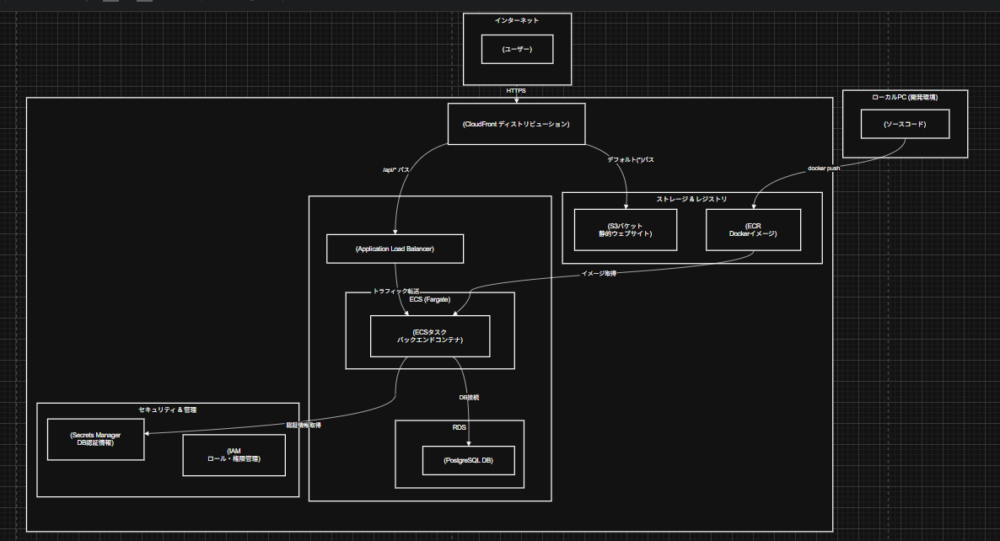

# フルスタック・ブックマーク管理アプリ (AWS ECSデプロイ)

## 概要

このプロジェクトは、モダンなWeb開発技術（React, Python/Flask）とクラウドサービス（AWS）を用いて、フルスタックなWebアプリケーションをゼロから構築し、コンテナ技術（Docker）を使って本番環境へデプロイするまでの一連のプロセスを実践するために作成したポートフォリオです。

単にアプリケーションを開発するだけでなく、スケーラブルで堅牢な本番環境をAWS上に構築し、その過程で発生する様々な問題を解決する能力を証明することを目的としています。

## デモ

**現在、AWSリソースはコスト管理のため削除済みです。** 以下の動画は、実際にAWS上でアプリケーションが動作していた際のデモです。

[https://www.youtube.com/watch?v=FNK4mq2lKmU]

## 主な機能

-   ブックマークの登録（URL, タイトル, 説明）
-   登録済みブックマークの一覧表示
-   （今後の実装予定）
    -   ブックマークの編集・削除機能 (CRUD)
    -   タグ付け・タグによる絞り込み機能
    -   ユーザー認証機能

## アーキテクチャ

このアプリケーションは、以下のAWSサービスを連携させた、モダンでスケーラブルなクラウドネイティブアーキテクチャを採用しています。


## 使用技術

### フロントエンド
-   **言語・ライブラリ:** JavaScript, React (Vite)
-   **スタイリング:** CSS
-   **API通信:** axios

### バックエンド
-   **言語・フレームワーク:** Python, Flask
-   **データベース連携:** SQLAlchemy
-   **WSGIサーバー:** Gunicorn

### データベース
-   PostgreSQL

### インフラ・デプロイ
-   **コンテナ技術:** Docker, Docker Compose
-   **クラウドプロバイダー:** AWS
-   **主要AWSサービス:**
    -   **コンピューティング:** ECS on Fargate
    -   **データベース:** RDS for PostgreSQL
    -   **ネットワーキング:** VPC, Application Load Balancer (ALB), Security Groups
    -   **CI/CD & ホスティング:** ECR, S3, CloudFront
    -   **セキュリティ:** IAM, Secrets Manager

## 乗り越えた課題とトラブルシューティング

このプロジェクトのデプロイ過程では、プロの現場でも起こりうる数多くの技術的課題に直面しました。以下はその一部と、その解決策です。

* **課題1: Dockerコンテナが起動しない**
    * **現象:** `docker-compose up` 実行時にプロセスがフリーズ。
    * **原因特定:** ターミナルやDocker Desktopの再起動、`docker pull` の手動実行などを通じ、PCのファイアウォールによるDocker Hubへのネットワーク接続不良が原因であると特定。
    * **解決策:** Dockerの再起動により接続を安定させ、`docker run hello-world` で正常な通信を確認してからビルドを再開。

* **課題2: ECSタスクの起動失敗（権限不足）**
    * **現象:** ECSタスクが`AccessDeniedException`で起動に失敗。
    * **原因特定:** 停止したタスクのCloudWatch Logsを分析し、ECSのタスク実行ロール (`ecsTaskExecutionRole`) に、Secrets Managerからデータベース認証情報を取得する権限 (`secretsmanager:GetSecretValue`) が不足していることを発見。
    * **解決策:** IAMコンソールにて、対象のロールに不足している権限ポリシーをアタッチすることで解決。

* **課題3: データベースへの接続エラー**
    * **現象:** バックエンドコンテナは起動するが、DB接続でクラッシュ。ログには `relation "bookmarks" does not exist` と記録。
    * **原因特定:** 新しく作成したRDSデータベースが空であり、アプリケーションが使用するテーブルがまだ作成されていないためと判断。
    * **解決策:** Flaskアプリの起動時に `db.create_all()` を実行するコードを追加し、コンテナ起動時にテーブルが自動で作成されるように修正。イメージを再ビルドし、デプロイして解決。

* **課題4: デプロイしたアプリが正常に動作しない（フロントエンドのクラッシュ）**
    * **現象:** デプロイされたURLにアクセスすると、画面が一瞬表示されて真っ白になる。ブラウザコンソールには `.map is not a function` というエラー。
    * **原因特定:** `curl` コマンドでAPIエンドポイントを直接テストした結果、期待するJSONではなく`index.html`が返ってきていることを発見。CloudFrontのルーティング設定（ビヘイビア）が、`/api/*` へのリクエストを正しくバックエンド（ALB）に転送できていないことが原因だと特定。
    * **解決策:** ALBの**ヘルスチェックパス**が、アプリ側のAPIルート（`/api/bookmarks`）と一致していなかったことが最終的な根本原因でした。ターゲットグループのヘルスチェックパスを修正することでALBがコンテナを正常と判断し、CloudFrontからのリクエストが正しくバックエンドに届くようになり、問題を完全に解決した。

## ローカルでの実行方法

1.  このリポジトリをクローンします。
2.  プロジェクトのルートディレクトリで、以下のコマンドを実行します。
    ```bash
    docker-compose up --build
    ```
3.  ブラウザで `http://localhost:5173` にアクセスします。


